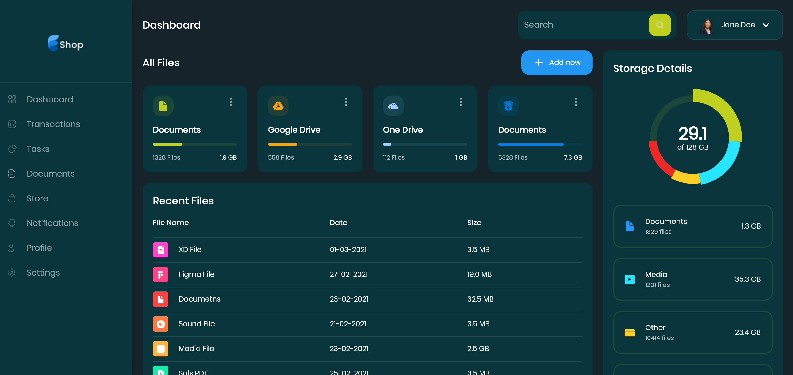
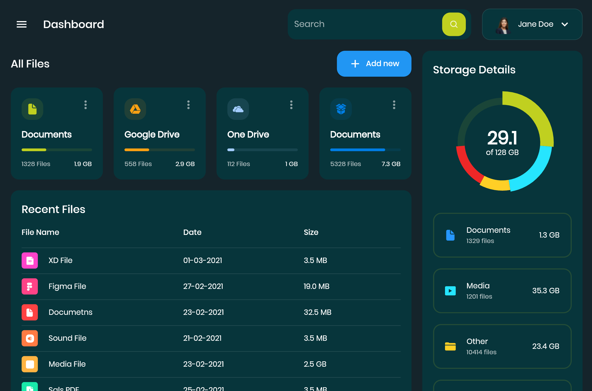
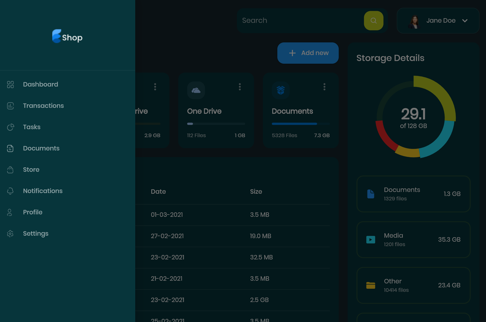

# Responsive Admin Panel/Dashboard in Flutter

  

## Screenshots

### Desktop

### Tablet

### Mobile

## Features

- Modern fluid design with rounded corners and flat colours.
- Spacing, border radius, and colour palette can be adjusted from a single source: [lib/constants.dart](lib/constants.dart)
- Cross platform - supported on all platform that Flutter can run on.

## Testing/Running the Demo

Make sure you have flutter installed and added to path. Then, simply use `flutter run` and target the platform of your choice.

## License

This project is released under the [MIT License](LICENSE).

## Acknowledgements

- [The Flutter Way](https://www.youtube.com/channel/UCJm7i4g4z7ZGcJA_HKHLCVw) for the excellent tutorial: [Responsive Admin Panel or Dashboard - Flutter UI - Speed Code](https://www.youtube.com/watch?v=_uOgXpEHNbc)
- The official [Flutter documentation](https://flutter.dev/docs).
- [gThumb](https://gitlab.gnome.org/GNOME/gthumb) - An excellent, easy-to-use image editor for basic image editing tasks. (FOSS)
- [ffmpeg](https://ffmpeg.org/) - CLI tool that I use to convert video to GIFs. (FOSS).
- [readme.so](https://readme.so/) - Free tool to quickly create a complete, structured Readme file.
